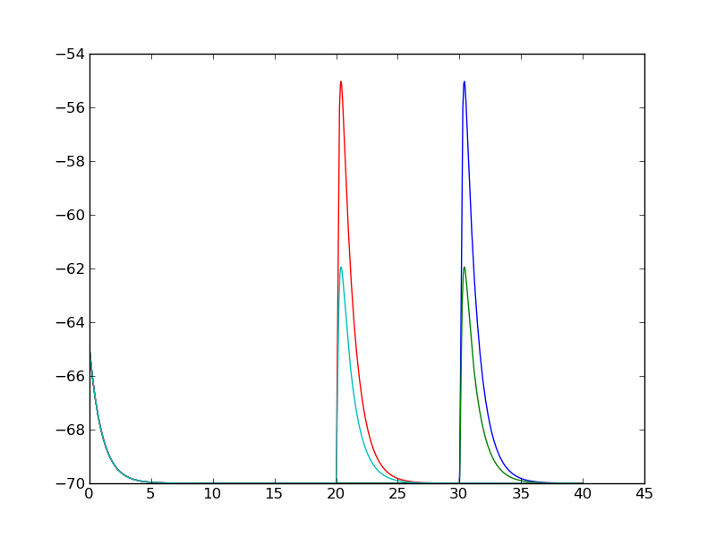

#######################
NEURON Project Workflow
#######################

************
Introduction
************

This project template and tutorial demonstrates how to set up a NEURON 
simulation environment (or wrap existing models) with the ability to easily:

- Parameterize the model.
- Manage several evolving source code files.
- Reproduce a given simulation from its original code or with updated sources.
- Interface with HOC code and HOC models.
- Manage and analyze the results of several simulations.
- Deliver beautiful and clear documentation.

Managing the project is key, and this emplate and tutorial is aimed at 
providing an expandable framework demonstrating good software design 
practices while utilizing solid Python management tools. In this project, 
we will be using Python as the interface language to NEURON. We will manage 
versions of code with `Mercurial <http://mercurial.selenic.com/>`_. We will 
perform some simple simulations and manage simulation output files with a 
Python database. We will document and comment sources with `reStructuredText \
(reST) <http://docutils.sourceforge.net/rst.html>`_ and output the 
documentation in HTML and PDF with `Sphinx <http://sphinx.pocoo.org/>`_.

After exercising the code to do these wonderful things, we will walk through
the code to gain a deeper understanding of how this functionality is delivered.    
    
.. Note:: In the code examples, 
   Python commands are sometimes denoted with ``>>>``, but usually are not. A
   command entered *outside* of Python in a terminal window is denoted with
   ``$``.

*************************
Installation Instructions
*************************

.. ifconfig:: sagebuild

    .. Note::
    
        If you are simply exercising the web examples, you do not need to 
        perform any installation and can jump to :ref:`project_files`.


The project requires several components. If you are starting out with none of
these packages nor a Python build of NEURON, it will probably take around an 
hour to install.


Install Python
==============

If Python is not already installed on your system. Install it from 
http://www.python.org/download/. Note, you may need to be root or have
system administration privileges to install Python.

Confirm that python works from the command line. From a terminal window:

.. code-block:: bash

    $ python
    
If this does not work, you may need to set your system path to point to Python.


Install various Python modules
==============================

You will need to install various Python modules. With each module, it 
installation can run the gamut from extremely simple to frustratingly complex. 
In general, we recommend installing ``Setuptools`` first and then proceeding 
with an "``easy_install``" after that. However, for Ubuntu, see the 
:ref:`recipe below <ubuntu_recipe>`. On Windows systems, we found that 
*Setuptools* does not help and you have to use the individual installers that 
come with most packages. Please send your notes or recipes for installing the 
following packages. From http://pypi.python.org, install the following modules 
and their dependencies.

- Setuptools (Install this first and then follow the ``easy_install`` 
  instructions below).
- Numpy
- Matplotlib
- Neuronpy (Also available at http://www.neuron.yale.edu/download)
- Sphinx

.. _ubuntu_recipe:

On Ubuntu 10.04.1, Python-2.6 was installed by default and available pkgs 
could be installed by:

.. code-block:: bash
    
    $ sudo apt-get install python-setuptools
    $ sudo apt-get install python-numpy
    $ sudo apt-get install python-sphinx

The Sphinx package is only necessary for building the documentation. If you
want to get on with the tutorial, you can ignore this install for now.

With *easy_install*, which comes with *Setuptools*, installing Python packages
is, well, easy. From a terminal command window, type:

.. code-block:: bash
    
    $ easy_install <package>
    
.. Warning::

    You may need to be *root* or *superuser* to write to your Python install.
    
For the packages we need to install, try with ``easy_install``:

.. code-block:: bash

    $ easy_install numpy
    $ easy_install matplotlib
    $ easy_install neuronpy
    $ easy_install sphinx
    
If a package cannot be installed with ``easy_install``, then try other 
methods listed for the package. Many have binary executables. A useful
"unofficial" repository of binary installers is at
http://www.lfd.uci.edu/~gohlke/pythonlibs/.


Install Mercurial
=================

Mercurial is the version control tool for source code management used in this
project. Install it from http://mercurial.selenic.com/. (You may also try 
``easy_install mercurial``).


Install NEURON
==============

`Build NEURON from sources. \
<http://www.neuron.yale.edu/neuron/download/getdevel>`_ Follow the instructions
in this link explicitly, being sure that you configure your ``nrn`` build with 
the ``--with-nrnpython`` option and be sure to run ``python setup.py install``
from the *nrn/src/nrnpython* directory after you have run ``make install`` from
the *nrn* directory. See `here \
<http://www.davison.webfactional.com/notes/installation-neuron-python/>`_ for
more details and consult `the NEURON forum \
<https://www.neuron.yale.edu/phpBB/index.php>`_ if you have any installation
issues.

Make sure NEURON works from within Python:
    
.. code-block:: bash

    $ python
    >>> from neuron import h

You should see the text banner that NEURON was launched. Something like::

    NEURON -- VERSION 7.2 (438:9352a8126821) 9352a8126821
    Duke, Yale, and the BlueBrain Project -- Copyright 1984-2008
    See http://www.neuron.yale.edu/credits.html


Install the nrnproject
======================

To install the project template, we will clone *nrnproject*.:

.. code-block:: bash

    $ hg clone http://bitbucket.org/tommctavish/nrnproject
 

.. _project_files:

Project files
=============

.. ifconfig:: sagebuild
   
    .. include:: sagebuild.txt

The following files are part of the project.

*analysis*
    Directory for the storage of analyzed data.
    
*doc*
    Directory of documentation for the project.
    
*doc_index.html*
    The documentation for the project (really a re-direct to the file
    *doc/build/html/index.html*).

*README.txt*
    Text file that contains information on the project.
    
*sims*
    The output directory for simulations.
    
*src*
    Directory of source code files.

    
Run a simulation
================

We will run a simulation that makes a passive cell, inserts an excitatory alpha 
synapse to activate at 20 ms, records the results from a 40 ms run, and
displays the membrane potential in a graphic made with matplotlib.

From a terminal in the *nrnproject/src* directory execute the following 
command:

.. code-block:: bash

    $ python main.py

Or from within a Python terminal::

    >>> import main
    >>> main.run()
    
.. Insert another empty cell if building sage.
.. ifconfig:: sagebuild

    >>> 
        
The simulation will create a randomly-named subfolder in the *sims*
directory. In there will be a *plot.png* file, the graphic that was
written from the simulation that should look like this.

.. figure::  ../../sims/default_run/plot.png
   :width: 4in
   :align:   center
   :alt: Missing figure in sims/default_run/plot.png
    
   Matplotlib output when running the simulation.
   

***********
Code design
***********

This project contains a lot of core design functionality. In particular, the 
project is set up to be highly parameterized meaning that many values are not
hard-coded in the source. Default parameter values can be easily overridden on 
the command line and/or in another parameter file. The storage for these
parameters is a Python :py:class:`dict` that is easily expandable as the 
source code changes and new parameters are added or old ones are removed.
Output results of a simulation are written to a unique subdirectory of the 
*sims* directory. The parameters used in a simulation and other system
information is also written to this subfolder so it is simple to re-run the
simulation with a given set of parameters with the source code that was 
originally used. Managing simulation output is managed through Python commands.


Source files
============

Here is a brief summary of the source files of the project. Also see the 
`Source Reference`_.

- *main.py*
    Program entry point and management of project source code.
    
- *simrunner.py*
    Peripheral management of a simulation run to set the parameters and write \
    output results.

- *simrun.py*
    Python module that actually runs the simulation.

- *simrun.hoc*
    HOC analog to *simrun.py* to demonstrate how to use this management \
    scheme on existing HOC models.

- *defaultparams.py*
    Parameters used in the simulation.        

- *simdb.py*
    Interface for loading and interfacing with the database of simulation \
    output files.
    
- *fig1.py*
    Demonstration of interfacing with the database, analyzing simulation \
    output, and drawing a figure.
    
- *refbuilder.py*
    Script to build the source code reference documentation in reST format to \
    be compiled with Sphinx.
    
- *util.py*
    Functions shared by two or more of the above files.


Parameterization
================

The primary goal of running simulations is to test a model. However,
a model is typically a set of parameterized functions. Therefore, we can 
say that the goal of running simulations is to test the output of a given
parameter set through a set of functions. For this reason, simulations by
their nature are rather exploratory and may contain many varying 
parameters. It is also a common occurrence in modeling to explore some niche
in parameter space only to drift and see what happens when we tweak some 
other variable that was never in the original design. This can quickly become
unweildy. Keeping track of the variables and their corresponding outputs can 
be made much simpler if the model is parameterized at every step in the 
process, and especially at the beginning of the model design.

The design chosen here is to have all simulation variables stored in a Python
:py:class:`dict`, *sim_var*. To access a simulation variable, then, we call::

    sim_var['some_key']
    
where ``'some_key'`` is the name of a variable. As can be seen in the contents
of *defaultparams.py*, the file contains the *sim_var* dictionary for the 
few parameters used in this project.

.. literalinclude:: ../../src/defaultparams.py

As this file demonstrates, Python :py:class:`dict` objects can 
contain a variety of types of values. In fact, the value associated with a
given key can be any Python object -- even another dictionary. As you will see
later, we use this dictionary-of-dictionaries motif in the database design 
to manage simulation output.


Parameter files and the command line
====================================

Parameters can be easily overridden by passing in another value on the command
line. For example:

.. code-block:: bash

    $ python main.py "sim_var['asyn_gmax']=2"
    
will override the default value of *asyn_gmax* from a value of 1 nS to 2 nS.

Instead of running from the (bash) terminal. From the Python command line you
can also::

    >>> main.run(["sim_var['asyn_gmax']=2"])
    
.. ifconfig:: sagebuild

    >>> 
       

Alternatively, a completely different parameter file can be passed in.:

.. code-block:: bash

    $ python main.py ../sims/asyn_gmax_2/params.py
    
In this example, a simulation that ran with ``asyn_gmax = 2`` was performed and
the results were stored in the */sims/asyn_gmax_2* directory. Under the hood,
*'.py'* Python files on the command line are executed 
with Python's :py:func:`execfile` function. The file 
*sims/asyn_gmax_2/params.py* also contains a *sim_var* dictionary, so any 
duplicate keys in that dictionary override the default values.

.. Note::

    If keys do not overlap (i.e. there is no duplicate key) then subsequent
    keys specified will simply add elements to the *sim_var* dictionary with
    new keys.

The command line operates by evaluating arguments sequentially. With each
argument it first tests if it is a valid *'.py'* file, executing the 
complete file if it can. If it is not a file, then it tries the argument with 
Python's :py:func:`eval` function. While the 
above examples override *sim_var* entries, one can also supply miscellaneous
arguments on the command line::

    $ python main.py ../sims/asyn_gmax_2/params.py "debug_mode = True" \
    "print 'Running sim'" "verbose = 'High'"

The arguments in this command first override the *sim_var* dictionary by 
utilizing the parameter file found in the *asyn_gmax_2* directory and then 
executes a few other Python commands, theoretically inconsequential to the 
simulation output, but perhaps useful for development and runtime evaluation. 
Of course, these variables could also be stored in another dictionary, 
perhaps titled ``"run_flags"`` and stored in another file that is read in.

The execution of Python files and arguments on the command line is taken care
of with the :mod:`neuronpy.util.paraminit` module.


Saving simulation results
=========================

After the parameters on the command line have been processed, the output
directory is set. The default case is to assign incremental numbers as the name of 
the output folder. You may opt for creating
more meaningful directory names, such as correlating the names with parameter 
settings by modifying the :func:`util.set_sim_dir_id` function. If many 
simulations are performed, however, managing folder names can become difficult. 
The database (see below) works with the contents of the folders, so the 
folder name is inconsequential, which is why this simple naming scheme is used.

After the simulation is performed, output files are written to the simulation's
output directory. In addition to data written from a simulation run, 
the *sim_var* dictionary is written to the file *params.py*. Included in that
file are instructions on how to run the simulation with those parameters 
again. Additionally, another file, *info.py* is written. This contains 
system and other simulation information, written as the dict *sim_info*. 
This functionality is covered in the :func:`simrunner.write_dicts` in 
*simrunner.py*.


Rerunning a simulation
======================

The *params.py* file generated in the simulation's *sims/subdirectory/*
can be used to repeat the simulation.:

.. code-block:: bash

    $ python main.py ../sims/some_subdirectory/params.py
    
This will simply copy the *sim_var* dict of the previous simulation's 
*params.py* file and create a new, unique simulation output folder so as 
not to overwrite previous output files. If you want to reuse the same output
directory and overwrite previous output, execute with ``--replace`` in 
the command line:

.. code-block:: bash

    $ python main.py --replace ../sims/some_subdirectory/params.py
    
This may be useful in cases where you assign values in a parameter file 
*before* running a simulation. Simply make a subdirectory in *sims* and point 
the run at this parameter file. 


*******************
Simulation database
*******************

Each simulation's output is stored in a unique folder in the *sims* 
directory. The design of the database is largely to retrieve the directory
names from those simulations that match particular criteria easily and quickly.
The database is built dynamically, the idea being that it can be built quickly 
by iterating through all of the simulation folders, reading all necessary 
files, and storing the data in RAM.

The database structure is quite simple. It is a dictionary of dictionaries. 
(There is no limit to the nesting of dictionaries). The keys of the root 
dictionary are the *sims/subfolder* names and the values are the
*sim_var* and *sim_info* subdictionaries. The :func:`simdb.build_database`  
function loads the dictionaries within these subfolders.


Run some simulations for the database
=====================================

Let's run some simulations to generate data to exercise the database. From
the terminal window, execute the following:

.. code-block:: bash

    $ python main.py
    $ python main.py "sim_var['asyn_gmax']=2"
    $ python main.py "sim_var['asyn_gmax']=2" "sim_var['asyn_onset']=30"
    $ python main.py "sim_var['asyn_onset']=30"
    
Or from within Python::

    >>> import main
    >>> main.run()
    >>> main.run(["sim_var['asyn_gmax']=2"])
    >>> main.run(["sim_var['asyn_gmax']=2", "sim_var['asyn_onset']=30"])
    >>> main.run(["sim_var['asyn_onset']=30"])
    
This will run four different simulations changing the magnitude and onset
of the synapse.
    

Build the database
==================

Here is the code to create a dict-of-dicts database of the dictionaries in the
sims subfolders::

    >>> from neuronpy.util import dictdb
    >>> import simdb
    >>> db = simdb.build_database()[0] # Build database using the sims folder.
    
We can now utilize this dict of dicts.

.. seealso::

    :mod:`neuronpy.util.dictdb`
    

Query the database
==================

To query the database, we call the :py:func:`neuronpy.util.dictdb.filter_dict`
function passing in a :py:keyword:`lambda` function as our filter. This
:py:keyword:`lambda` function gets called on every item in the database and 
has the form::

    lambda k, v, p : some_function_that_evaluates_to_True_or_False(k, v, p)

where ``k`` is the item's key, ``v`` is the item's value, and ``p`` is a list 
of any parent keys leading to this key. (``p`` can effectively be ignored if
the key is unique to a record).

As an example, we could query for those simulations that have 
an *asyn_onset* greater or equal to 30::

    >>> sub_dict = dict(dictdb.filter_dict(db, lambda k, v, p: \
    ...         k == 'asyn_onset' and \
    ...         v >= 30))
    >>> for sub_dir in sub_dict.iterkeys():
    ...     print sub_dir

.. _analyze:

****************
Analyze the data
****************

The *sims* folder contains the simulation data that the database references.
We analyze that data and store the results in the *analysis* folder. The 
*fig1.py* file provides an example of a script that builds the database,
searches for records, and from the retrieved set of directories, unpickles the
vectors that were recorded in the simulation and combines them into one 
graphic, saved as a PDF file, *fig1.pdf* in the *analysis* folder.

The source of *fig1.py* is

.. literalinclude:: ../../src/fig1.py

Execute this file::

    python fig1.py
    
Or

::

    >>> import fig1
    >>> fig1.run()

You should see the file *fig1.png* in the analysis folder that looks like
this:


    
   Output of *fig1.py*.
   

*****************************
Source control with Mercurial
*****************************

All of the *'.py'* files in the *src* directory are under source control
using `Mercurial <http://mercurial.selenic.com/>`_. This means that 
modifications to the code are tracked and can be reverted to previous versions 
to recreate simulations. Incremental changes to the source code are logged with 
changesets -- each changeset committed by the user. To ensure that a simulation
can revert back to a particular set of sources to re-run it, any modifications 
to the repository of source code must be committed before the simulation is 
performed.

To test the source control system, edit *simrun.py*. After the line 
``soma.insert('pas')`` insert::

    # Insert a basic Hodgkin-Huxley active mechanism
    soma.insert('hh')

.. ifconfig:: sagebuild

    If working over the web, the following script makes this change.
    
    .. raw:: html
       
        {{{id=3|
        import fileinput
        filename=os.path.join(datadir, 'src', 'simrun.py')
        
        for line in fileinput.input(filename, inplace=1):
            if line.startswith('    soma.insert'):
                print '    soma.insert(\'hh\')'
            print line,
        ///
        }}}

Save the changes and attempt to run *main.py*:

.. code-block:: bash

    $ python main.py
    
Or

::

    >>> main.run()
    
You should get the following error::
    
    Changes have been made since the tip changeset.
    You need to either commit these changes or revert
    to the last changeset!
      The following files have been modified since the 
      last changeset:
        src/simrun.py

This tells us that we have not committed this modification to the repository.
To commit the changes::

    $ hg commit -m "Added HH dynamics to simrun"

.. ifconfig:: sagebuild

    If working over the web, the following script makes this change.
    
    ::
    
        >>> os.system('hg commit -R %s -m "Added HH dynamics to simrun"' \
        ...         %datadir)

        
We should now be able to launch.

The response when running the simulation now still does not generate an action
potential, but the waveform is different than that of the completely passive 
system. Additionally, the resting membrane potential is about -68 mV instead 
of -70 mV as in the passive case.

    
Re-running a simulation
=======================

Mercurial information, including the changeset id of the last committed
sources, is stored in the ``'hg'`` dict, a subdict of *sim_var*. This subdict
is absent in *defaultparams.py*, but gets made and inserted into any newly 
created *params.py* files in the simulation output directory. When re-running
a simulation with this *params.py* file, it finds ``'hg'`` and can revert
sources.

To re-run a simulation, navigate to one of the folders that was created before
you implemented the Hodgkin-Huxley dynamics, and open the *params.py* file
located there. Copy and paste the command to launch that simulation into the
command line of the form:

.. code-block:: bash

    $ python main.py ../sims/some_subdirectory_with_passive_only/params.py
    
This will recreate a new folder whose output contains a passive response.
Double-check the same command with your active response.:

.. code-block:: bash

    $ python main.py ../sims/some_subdirectory_to_hh_sim/params.py
    
That should recreate the identical output as your active response.


Re-running a simulation with the current changeset
==================================================

You may want to re-run a simulation with the current changeset and not the
changeset used by the original simulation. In this case, add the ``--tip``
directive.:

.. code-block:: bash

    $ python main.py --tip ../sims/some_subdirectory/params.py
    
This will make a new subfolder in the *sims* directory, but using the 
parameters defined in this particular *params.py* file. You can combine the
``--tip`` directive with ``--replace`` to overwrite the previous output. In
this case, the current changeset is stored with these parameter settings and
the previous changeset id is no longer associated.

    
*************
Documentation
*************

To document the project and build either the HTML or PDF file you are now 
reading, we use `Sphinx <http://sphinx.pocoo.org/>`_. A *Makefile* has been
created in the *doc* directory. It contains the instructions for building
html or pdf documents. It looks in the *doc/source* folder for *'.rst'*
files and, in particular, chooses *index.rst* as the root file.


Compiling HTML
==============

To create the HTML documentation, from a terminal window in the *doc*
directory:

.. code-block:: bash

    $ make html
    
This will create pages available in *doc/build/html*. In particular, the
file *index.html* is the root file.

.. Note::

    The file *doc_index.html* in the project root simply contains a 
    re-direct to *doc/build/html/index.html*, so the file you are really
    viewing when you open *doc_index.html* is *doc/build/html/index.html*.
    
    
Compiling PDF
=============

Compiling a PDF document is just as easy (assuming you have all the necessary 
tex system installed). Again, from the *doc* directory:

.. code-block:: bash

    $ make latexpdf
    
This will create a *latex* folder in the *doc/build* folder. The output file,
in this case `nrnproject.pdf <../latex/nrnproject.pdf>`_ will be created, and 
should look quite nice despite the possibly long list of tex messages and 
warnings encountered through the documentation build process.


Comment your code!
==================

Use `Pylint <http://www.logilab.org/project/pylint/>`_ on your code to make
sure it is robust and clean. Mostly, however, comment 
your code with docstrings that not only describe what a method and its 
parameters are, but *why* they are there. The more you comment, the more 
robust your code will be. Try and provide examples in the docstring of a 
method's use. These embedded code examples can also be tested during the 
compilation of the code into documentation using Sphinx.


Math and LaTeX
--------------

Part of writing good documentation may be to write equations. Sphinx can 
compile latex code when given the **math** directive. For example::
            
    The Hodgkin-Huxley Equation:
    
    .. math::    
        
        V_{m} = C_{m} \frac{\partial V_{m}}{\partial t} + 
        \left [\sum_{i} G_{i}\left(V_{m},t \right) \cdot (V_{m}-E_{i}) \right ] 
        + G_{L}(V_{m}-E_{L})
    
    where :math:`V_{m}` is the membrane potential in volts, :math:`C_{m}` is  
    the membrane capacitance expressed in :math:`\textrm{Farad/cm}^{2}`, 
    :math:`G_{i}(V_{m} ,t)` is the conductance of ion :math:`i` as a function
    of the membrane potential and time, :math:`E_{i}` is the reversal potential
    for ion :math:`i`, and the :math:`L` subscript denotes the leak 
    conductance.

Will give the following output:

---------------

The Hodgkin-Huxley Equation:

.. Actually, SAGE will not draw as proposed above, but this is equivalent.

:math:`V_{m} = C_{m} \frac{\partial V_{m}}{\partial t} + \left [
\sum_{i} G_{i}\left(V_{m},t \right) \cdot (V_{m}-E_{i}) \right ] +
G_{L}(V_{m}-E_{L})`

where :math:`V_{m}` is the membrane potential in volts, :math:`C_{m}` is  
the membrane capacitance expressed in :math:`\textrm{Farad/cm}^{2}`, 
:math:`G_{i}(V_{m} ,t)` is the conductance of ion :math:`i` as a function
of the membrane potential and time, :math:`E_{i}` is the reversal potential
for ion :math:`i`, and the :math:`L` subscript denotes the leak 
conductance.

------------------

.. warning::

    The **math** directive for Sphinx can be used within reST files but when
    inside a docstring, slashes need to be escaped. Therefore, 
    ``:math:`\delta``` should be written as ``:math:`\\delta```. 
    Alternatively, an "r" can prepend any docstring to make it explicit that
    it is "raw", and in this case reST-formatted.
    :: 
    
        def one_way():
            r"""The docstring with :math:`\delta`. Notice the prepended 'r',
            which designates it as a "raw" string. Always prepending with
            an 'r' will treat as reST string."""
            
        def another_way():
            """The docstring with :math:`\\delta`. Notice the extra '\'."""

.. Note::

    If you search the internet for ``"sphinx cheat sheet"`` or choose the 
    ``Show Source`` link in many Python docs you will be able to 
    find several other examples of reST text formatting.


Reference documentation for source code
=======================================

Docstrings in source files enable you to document your code. This is fairly
automatic using the :py:mod:`refbuilder`. From a terminal window in the *src*
directory:

.. code-block:: bash

    $ python refbuilder.py
    
This will create *'.rst'* files in the *doc/sources* directory of those
classes you want to document. To specify source files to document, assign them
in the *modules* list in *refbuilder.py*. Of particular note, the file
*api.rst* will be created and your *index.rst* needs to have the following
line to properly include it.::

    .. include:: api.rst
    
Alternatively, you may want to add it to the Table of Contents tree, which
does not need the *'.rst'* extension.::

    .. toctree::
    
        api

.. Note::

    You only have to run *refbuilder.py* when you add or remove sources. When
    you build your documentation, it will use the latest sources without 
    having to run *refbuilder.py*.
    

Setting up the Makefile
=======================

If you want to customize Sphinx output from the existing format, from the 
main project directory:

.. code-block:: bash

    $ sphinx-quickstart
    
Set the directory to *doc* and answer the questions. (Also see
http://sphinx.pocoo.org/config.html). In addition
to creating the *Makefile*, this creates a new *source/conf.py* file. 
Assuming the same type of directory structure of a ``doc`` and ``src`` folder,
For documentation of your sources, you need to add the following line near the 
top of the resulting *conf.py* file.::

    sys.path.append(os.path.abspath('../../src'))


*********************
Extending the project
*********************

This project is largely a template. To create your own project with this 
template, start by cloning this one with a command like:

.. code-block:: bash

    $ hg clone http://soma.yale.edu/sources/nrnproject mymodel
    
You will obviously assign your own parameters, run your own custom model, and
analyze your data any number of ways. So, once installed, the main files in 
your *src* directory that you will need to edit are:

- *defaultparams.py*
- *fig1.py*
- *simrunner.py*
- *simrun.py*

You can largely leave *main.py* and *simdb.py* intact. Even *simrunner.py* may
not need much editing, simply modify :func:`simrunner.run_sim` to point to 
your run module. The only thing to edit in *refbuilder.py* is the list of 
sources you want to document. As you add/remove files from your project, 
make sure the :py:data:`modules` list in :py:mod:`refbuilder` mirrors the 
items you want to document.

Your cloned project is already set up with an hg repository, but it is 
important to add and remove sources from the hg database as necessary.

.. code-block:: bash

    $ hg add src/some_new_file.py

or

.. code-block:: bash

    $ hg remove src/some_unnecessary_file.py


Using and managing HOC models
=============================

While this tutorial has so far used 100% python code, we can also utilize 
hoc code and files in this environment. This allows us to use existing 
models and files in this scheme.

For example, this is how :mod:`simrunner` calls the Python simulation:

.. literalinclude:: ../../src/simrunner.py
   :pyobject: run_sim
   
Contrast this code with how it calls the hoc file:

.. literalinclude:: ../../src/simrunner.py
   :pyobject: run_sim_hoc

To use the file, *simrun.hoc* and execute that simulation instead of the Python
version, in the :func:`simrunner.run` function, comment out the call to 
``run_sim()`` and replace with a call to ``run_sim_hoc()``::

    #run_sim() # Run the simulation
    run_sim_hoc()
        
Save the file, and then commit the changes and run.:

.. code-block:: bash

    $ hg commit -m "Running HOC simulation instead of Python"
    $ python main.py
    
We will contrast the HOC and Python code in the next chapter.
   
Edit this file!
===============

To write documentation for your project, start by editing the file used to
create this documentation -- *doc/source/index.rst*. Write and rerun 
:py:mod:`refbuilder` if necessary, and then 
recompile the documentation in HTML or PDF formats. Again, there are many 
examples on the internet on how to write reST documentation.


*****************************************
Under the hood: Stepping through the code
*****************************************

The previous chapters demonstrated how to interface with the project. In this
chapter we explore the code so you gain a deeper understanding of its design
so that you can more easily customize and extend your own projects.

main.py
=======

Preliminaries
-------------

You will notice in the header a looooong docstring. Since this is the main 
entry point to the program, it explains how to use it with extensive examples. 
The docstring is:

.. literalinclude:: ../../src/main.py
   :start-after: # -*- coding: utf-8 -*-
   :end-before: __version__ = 0.1

See :mod:`main` to see how this docstring renders.

The :py:keyword:`import` statements follow the convention of importing needed
Python system modules before other modules. We also import utility modules
from neuronpy.

.. literalinclude:: ../../src/main.py
   :start-after: import sys, subprocess, os
   :end-before: import util
   :prepend: import sys, subprocess, os
   :append: import util

We create and initialize global variables. The boolean values will get reset,
if necessary, depending on the parameter args. The ``sim_var`` and ``prj_tmp``
dicts are initialized to empty.

.. literalinclude:: ../../src/main.py
   :start-after: import util
   :end-before: def run(argv = None):
   

Program entry point
-------------------

When executed from the command line, the following code gets called:

.. literalinclude:: ../../src/main.py
   :start-after: if __name__ == '__main__':
   :prepend: if __name__ == '__main__':
   
Arguments from the command line are passed in ``sys.argv``. The first argument
is the name of the script, simply ```main.py'``, which we can ignore. We pass
subsequent args to :func:`~main.run`.

.. Note::

    By having a separate :func:`~main.run` function, we can call the program
    from Python instead of only by the command line.:
        
    .. code-block:: bash
    
        $ python
        >>> from main import *
        >>> run(["sim_var['asyn_gmax']=2", "sim_var['asyn_onset']=30"])


The main loop
-------------

The code to the main loop is fairly self explanatory.

.. literalinclude:: ../../src/main.py
   :pyobject: run
   
.. Note::

    It is important that the :mod:`simrunner` functionality be outside this
    module and launched as a subprocess. Modules that are loaded in ``main``'s
    process already reside in RAM and are not reverted in it's process. To 
    ensure proper source control, :mod:`main` reverts sources so that
    :mod:`simrunner` loads those reverted sources into its own subprocess.


Initialize
----------

Here is the code for :func:`~main._initialize`. It initializes the simulation
parameters, setting ``sim_var``, reverting sources if necessary, and sets the
simulation output directory.


.. literalinclude:: ../../src/main.py
   :pyobject: _initialize
    
.. Note::

    While Python does not have explicit "public" and "private" objects and 
    methods (they are all public), a prepended underscore ``_`` is a common
    nomenclature for hiding objects in the sense that Sphinx does not include
    it in user documentation. While the code to :func:`~main._initialize` is
    shown here, it is not meant to be called outside :func:`~main.run`.
    

By design, the `defaultparams.py <../../../src/defaultparams.py>`_ file does 
not contain a reference to any mercurial changeset. However, when a simulation 
runs and writes its parameters to *params.py*, an ``hg`` subdictionary is 
written to that ``sim_var`` dict. Therefore, when read back in, if the ``hg`` 
key exists in ``sim_var``, then we revert to the changeset. 

.. Warning::

   It is important to note that up to this point we should not have 
   loaded or imported any file that may have been reverted with source control.
   If it was loaded, like in an :py:keyword:`import` statement at the beginning
   of the file, any call to revert to another changeset would be 
   inconsequential. This means that :mod:`main` *always* operates with the 
   latest, "tip" changeset since it is already loaded. Therefore, while 
   :mod:`main` drives the simulation, it should not directly affect the 
   output so results are truly repeatable, hence the reason for 
   :mod:`simrunner`.

The last lines set the output directory, if we are not replacing it. It is 
accessible as ``sim_var['sim_dir_id']``.


The output directory
--------------------

Here is the code for :func:`util.set_sim_dir_id`.

.. literalinclude:: ../../src/util.py
   :pyobject: set_sim_dir_id

This sets the output directory variable so that it is available as we run the
simulation. Since we are using a database that reads output files inside the
*sims* directory, the name of a given simulation's subdirectory is 
inconsequential. Therefore, we make up a random name as a universal unique 
identifier. You may want to specify something more informative if you are 
just running a handful of simulations.


simrunner.py
============

Preliminaries
-------------

.. literalinclude:: ../../src/simrunner.py
   :start-after: import util, simrun
   :end-before: def run(argv = None):


You will notice that there is a definition for ``sim_var``. Wasn't that already
defined in :mod:`main`? Sort of. The :mod:`simrunner` module is designed to
run independently of :mod:`main`, if desired. If :mod:`main` launches 
:mod:`simrunner` as a subprocess, then :mod:`main` passes to :mod:`simrunner` 
an argument that defines ``sim_var``. Therefore, :mod:`simrunner`'s default 
``sim_var`` values are overriden by those processed in :mod:`main`.

Main loop
---------

The :func:`~simrunner.run` function is similar to that in :mod:`main`. It
processes the args, runs the simulation, and writes output.

.. literalinclude:: ../../src/simrunner.py
   :pyobject: run

   
Run a simulation
----------------

The code to launch a simulation is covered in `Using and managing HOC models`_.
   
We simply record the start time. Next we call into the :mod:`simrun` module to 
actually run the simulation, which gives us two hoc vectors ``v_vec``, the 
membrane potential, and ``t_vec``, the corresponding timestamps of the membrane
potential. Those are picklable objects that we dump to files in the simulation
output directory.


Write the vectors and image
---------------------------

Given the hoc vectors, we pickle them, write them to a file, and also write a
new matplotlib graphic.
 
.. literalinclude:: ../../src/simrunner.py
   :pyobject: write_output

:ref:`As we saw before <analyze>`, *fig1.py* gave an example of unpickling these
vectors.
   
Save parameter and simulation settings
--------------------------------------

The :func:`~simrunner.write_dicts` function captures the end time of the
simulation and other platform information, then writes the ``sim_var`` dict
to *params.py* and the ``sim_info`` dict to *info.py*.

This concludes the look at the source code. Also see the `Source Reference`.

   
*************************
Other tools and resources
*************************

While this tutorial did not discuss other tools, there are several of 
important mention to assist in development.:

- `Scipy <http://www.scipy.org>`_
    While this simple example did not use the scipy library, it easily could
    have. Scipy is a nice library for scientific and engineering computing.

- `SAGE <http://www.sagemath.org>`_
    An assembly of several open-source packages. Developed largely for \
    mathematics, it includes several important Python packages such as \
    `scipy and numpy <http:www.scipy.org>`_ and 
    `matplotlib <http://matplotlib.sourceforge.net/>`_. Its web interface \
    permits NEURON \
    simulations over the web and it is the engine behind NEURON's online \
    tutorials available at http://soma.med.yale.edu. Its web interface \
    operates as a digital lab notebook and code is executed in \
    "script block mode" similar to MATLAB's "cell mode" for easy prototyping.
    
- `IPython <http://ipython.scipy.org/>`_
    Is an interactive Python shell. It adds features to the normal command
    line. It can also work with Matplotlib for interacting with graphical
    output. Once installed, launching the application with.::
    
        ipython -pylab main.py
        
    should give an interactive plot of this simulation output.
    
- `Spyder <http://code.google.com/p/spyderlib/>`_
    Is an integrated development environment (IDE). It is useful for editing \
    multiple files, auto-complete, visualizing variables, executing complete \
    files or code snippets, and with the \
    `pylint extension <http://www.logilab.org/project/pylint/>`_, allows you \
    to scrub your code to a sheen. This project was made using this IDE.
    
- `Wing IDE <http://www.wingware.com/>`_
    Is another integrated development environment. It is free if you give the \
    site of your open source project in your license. It has all of the \
    features of Spyder, and may have even more.

- `NEURON Forum <https://www.neuron.yale.edu/phpBB/index.php>`_
    Is always a great resource for finding answers and posting your own \
    questions.
 
- `Hines, Davison, and Muller 
  <http://www.frontiersin.org/Neuroinformatics/10.3389/neuro.11.001.2009/
  abstract>`_

   Succinct information on the Python interface to NEURON.
    
.. include:: api.rst

.. raw:: html
   :file: sagebuild.html

